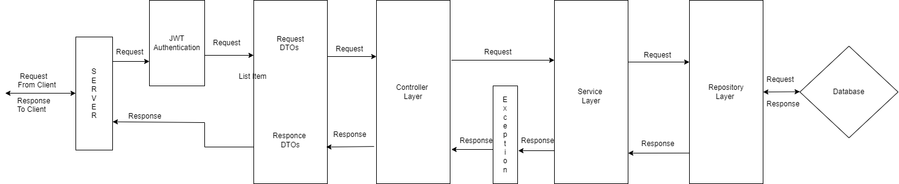
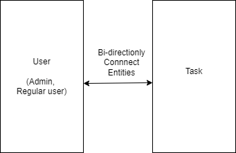
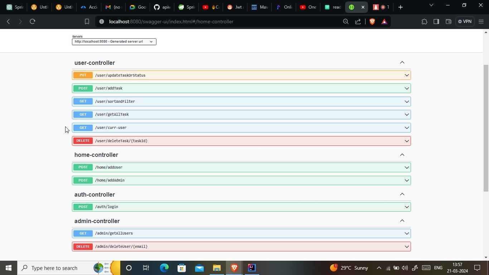

# Task Management APIs

The Task Management API developed using Spring Boot offers a robust and efficient solution for organizing, tracking, and managing tasks within an application ecosystem. Leveraging the power of Spring Boot's lightweight and flexible framework. From task creation and assignment to tracking progress and status updates, the API offers comprehensive functionalities to streamline task management workflows.

## Tech Stack :
1. Core Java
2. Spring Boot
3. MySql
4. Postman
5. Swagger
## Installation

Follow process given below to run project

```bash
  - Clone this repository to your local stytem.
  - Open it in your IDE.
  - Wait few minutes so that your system will install required dependencies.
  - create database in MySql with name "Task_management".
  - Go to  pom.xml change username and password there, according  to your user system's username and  password.
  - Then run project.
```


## Archietectural View



## Database View



## Here are the supported API's that  you can run by using postman or swagger




## Supported Request


1. **Add User**
   - Path: `http://localhost:8080/Home/addUser`
   - Method: POST
   - Request Body {
    "email" : "prateek7120@gmail.com",
    "userName": "Pratik",
    "password": "xyz"
}

2. **Add Admin**
   - Path: `http://localhost:8080/Home/addAdmin`
   - Method: POST
   - Request Body {
    "email" : "admin123@gmail.com",
    "userName": "123",
    "password": "abc"
}

(Note : based  on request  system will assign Roles)


3. **Login**
   - Path: `http://localhost:8080/auth/login`
   - Method: POST
   - Request Body {            
            "email":"prateek7120@gmail.com",
            "password":"xyz"
          }

4. **Create Task**
   - Path: `http://localhost:8080/user/addTask`
   - Method: POST
   - Request Body {            
           "title": "T1",
            "description": "T1 details ",
            "dueDate": "YYYY/MM/DD",
            "status": "pending",
            "userMail":"task@gmail.com"
          }

(Note: if logged is user is regular use he can only able  to assign  task to himselt and  if  admin is logged in then only he can able  to  assign task to anyone)

5. **Get All Task**
   - Path: `http://localhost:8080/user/getAllTask`
   - Method: GET
   (Note: This request will not take any parameter instead it will give responce based on logged in user,
   if logged in user in regulare user it return only task he have and if  logged in user  is admin it will return task of  all users)

6. **Update Task Or Status**
   - Path: `http://localhost:8080/user/updateTaskOrStatus`
   - Method: PUT
   - Request Body {            
           "taskId":"UUID",
           "title":"t1",
           "Description" : "v",
           "dueDate":"YYYY-MM-DD",
           "status" : "complete",
            "email": "email associated with tasks user"
          }

(Note: logged user can be able to update his task only
and admin is capable  of updating  any task. Inside body parameter you do not want update put "parameter_name" : null only)

7. **Delete Task**
   - Path: `http://localhost:8080/user/deleteTask/{id}`
   - Method: DELETE
   - Path Variable : task id only

8. **Get Current logged in user**
   - Path: `http://localhost:8080/user/curr-user`
   - Method: GET
   
(Note: this will return  email on current  login user)

9. **Get All Users**
   - Path: `http://localhost:8080/admin/getAllUser`
   - Method: GET
(Note :This will method is only allow to admin to use)
   

10. **Delete User by Email**
   - Path: `http://localhost:8080/admin/delete/{Email}`
   - Method: DELETE
   - Path Variable : email of user
(Note : admin is able to delete another admin and him also )


### Additional Features
  
11. **Sorting and Filter**
   - Path: `http://localhost:8080/user/sortAndFilter`
   - Method: GET
   - Request Body : {
     "sortByDate" : true or  false,
     "sortByStatus" : true or false,
     "filterByStasus" : "complete" or "inProgess" or "pending",
     "filterByDueDate" : null 
   }

(Note : keep field as null if you dont want to  filter by  that)

## Security And Error Handling
1. Implement high level roles based security integrated with JWT  authentication so that each point  will be well secured.

2. Used appropriate status code as well as Implemented error (exception) handling  mechanism

(Note : as this is  jwt authetication when u login system will generate one token which i am also giving you as  a responce so that you can use. And transfer  that token in header while using  any  api as 
Bearer _______  (replace blank field with jwt token)).